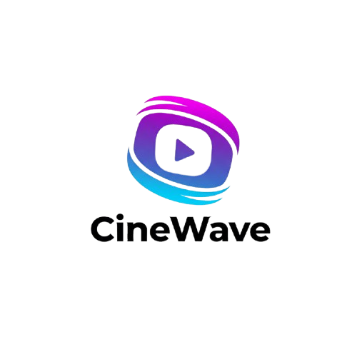

# CineWave – Full-Stack Movie Trailer & Group Watch Platform



**CineWave** is a modern, full-stack web application for discovering, watching, and sharing the latest movie and web series trailers. It features premium content, real-time group watch, secure payments, and a beautiful, responsive UI.

---

## 🚀 Features

- 🔑 **User Authentication** (Supabase)
- 🎬 **Browse & Watch Trailers** (Trending, Popular, Top Rated, Upcoming)
- ⭐ **Premium Content** (Subscription via Razorpay)
- 📝 **Watchlist, Likes, and Reviews**
- 👥 **Real-Time Group Watch & Chat** (Socket.io)
- 💳 **Secure Payments** (Razorpay)
- 📱 **Responsive, Modern UI** (Tailwind CSS, Framer Motion)

---

## 🛠️ Tech Stack

- **Frontend:** React, Vite, Tailwind CSS, Framer Motion, React Router
- **Backend:** Node.js, Express, Supabase (Postgres), Razorpay, Socket.io
- **Database:** Supabase/Postgres
- **Payments:** Razorpay
- **Real-Time:** Socket.io

---

## 📁 Project Structure

```
CineWave/
  frontend/   # React app (UI)
  backend/    # Node.js/Express API server
  README.md   # Project documentation
```

---

## ⚡ Getting Started

### 1. Clone the Repo
```bash
git clone https://github.com/anubhav-n-mishra/CineWave.git
cd CineWave
```

### 2. Setup Frontend
```bash
cd frontend
npm install
npm run dev
```

### 3. Setup Backend
```bash
cd ../backend
npm install
# Add your .env file (see below)
node server.js
```

---

## 🔑 Environment Variables (Backend)
Create a `.env` file in `backend/` with:
```
SUPABASE_URL=your_supabase_url
SUPABASE_SERVICE_ROLE_KEY=your_supabase_service_role_key
RAZORPAY_KEY_ID=your_razorpay_key_id
RAZORPAY_SECRET=your_razorpay_secret
CLIENT_ORIGIN=http://localhost:5173
```


## 📄 License
MIT

---

## 🙋‍♂️ Author
- [Anubhav Mishra](https://github.com/anubhav-n-mishra)

---

## ⭐️ Star this repo if you like it!
